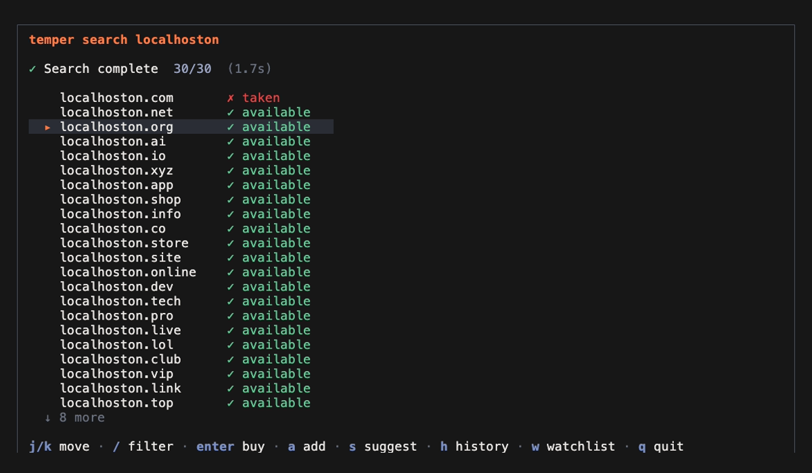
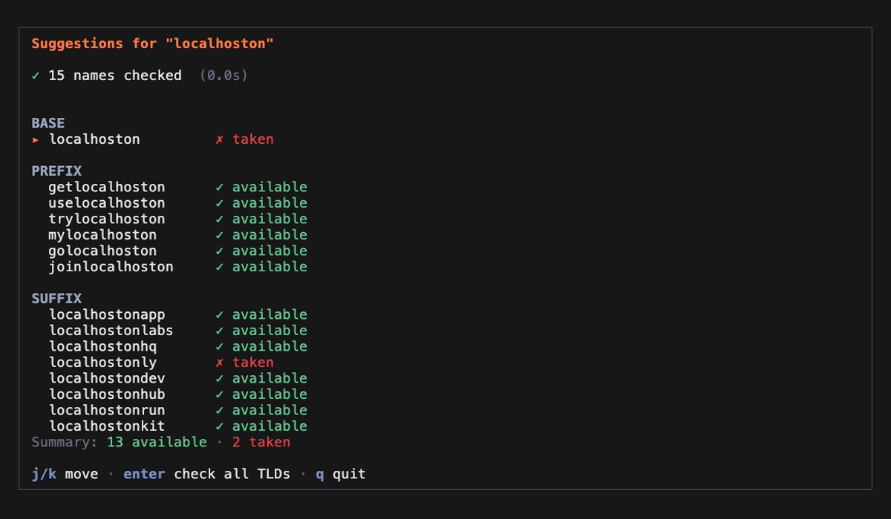
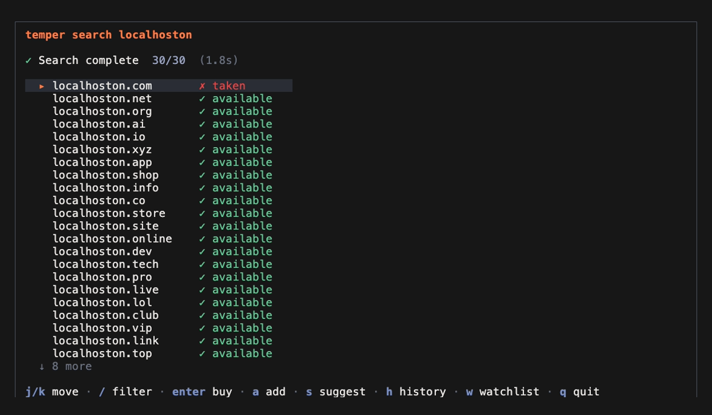
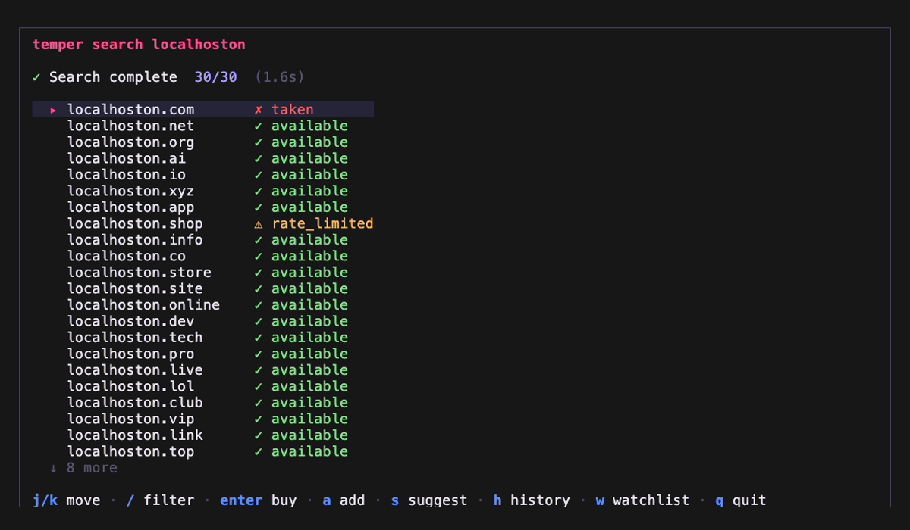
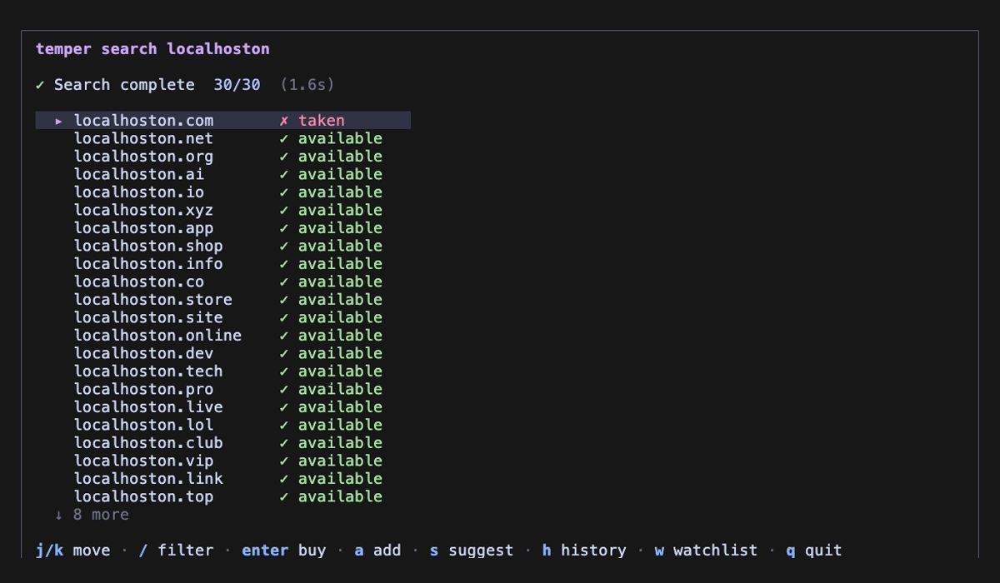
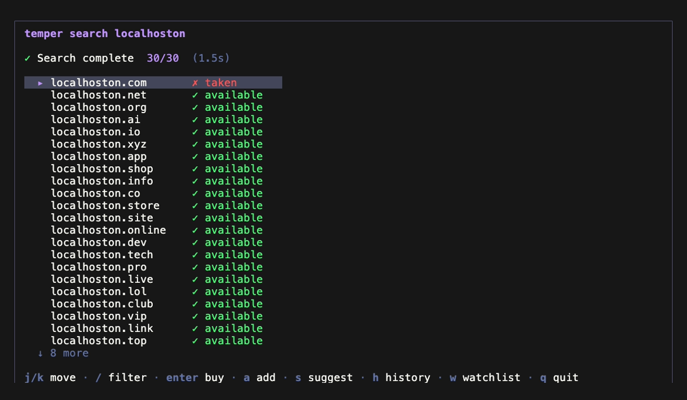
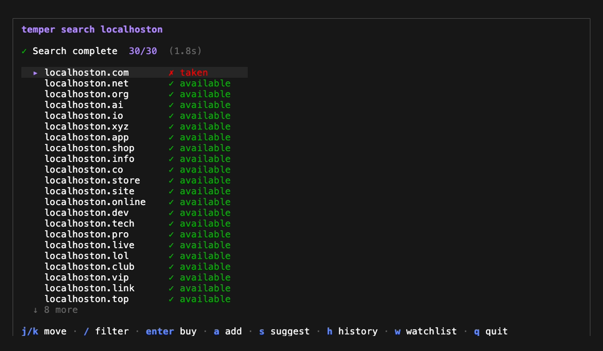

<p align="center">
  <picture>
    <source media="(prefers-color-scheme: dark)" srcset="./assets/logo-dark.png">
    <source media="(prefers-color-scheme: light)" srcset="./assets/logo-light.png">
    
  </picture>
</p>
<h1 align="center">temper</h1>
<p align="center">
  <strong>Never leave your terminal to find a domain.</strong>
</p>
<p align="center">
  Search domains, check availability, and open purchase pages — all from your terminal.<br>
  Works as a CLI, or as an MCP server so Claude and Cursor can search domains for you.
</p>
<p align="center">
  <a href="#install">Install</a> ·
  <a href="#usage">Usage</a> ·
  <a href="#mcp">MCP</a> ·
  <a href="#themes">Themes</a>
</p>

<p align="center"></p>

---

## Why

AI coding tools can't check if a domain is available. Claude suggests a name, you open a browser, search manually, come back — the flow breaks every time.

**temper fixes this.** One command. 30 TLDs. Under 2 seconds.

## Features

- **Private** — all queries run on your machine. No server, no logs, no tracking.
- **Fast** — 30 TLDs in under 2 seconds. 59 with `--extended`.
- **MCP native** — Claude Code, Claude Desktop, and Cursor can search domains directly.
- **Keyboard-first** — vim-style navigation, single-key registrar selection.
- **Pipe-friendly** — `--format json` for scripting and automation.
- **Themeable** — 5 built-in themes.
- **Open source** — Apache 2.0. Zero telemetry.

## Install

```bash
# Homebrew (macOS/Linux)
brew install jongjinchoi/temper/temper

# Or run with Bun
bun install && bun run src/index.ts search <name>
```

## Usage

### Keyboard shortcuts

| Key | Action |
|-----|--------|
| `j`/`k` | Move up/down |
| `Enter` | Buy domain / select |
| `/` | Filter results |
| `a` | Add to watchlist |
| `s` | Suggest combinations |
| `h` | Search history |
| `w` | Watchlist |
| `esc` | Back |
| `q` | Quit |

### Search

```bash
temper search myproject                          # 30 default TLDs
temper search myproject --extended               # 59 TLDs
temper search myproject --tlds com,dev,io         # specific TLDs
temper search myproject --tld-preset tech         # preset: tech, popular, startup, cheap
temper search myproject -a                        # available only
temper search myproject -t 5                      # 5s timeout (default: 3)
temper search myproject --format json             # JSON output for piping
temper search localhoston dashflow calmbox             # multiple keywords
```

Navigate with `j`/`k`, press `Enter` to buy, `a` to add to watchlist, `/` to filter. Press `s` for suggestions, `h` for history, `w` for watchlist. `q` to quit.

<p align="center"></p>

#### TLD Presets

```bash
temper show-presets

  popular    com, net, org, io, co, app, dev, ai, me
  tech       io, ai, dev, app, gg, sh, tech, cloud, digital
  startup    com, io, co, ai, app, dev, xyz, so, gg
  cheap      xyz, fun, lol, top, site, online, store, shop, club
```

#### JSON output

```bash
temper search localhoston --format json | jq '.[] | select(.status == "available") | .domain'
```

### Suggest

Generate name combinations and check `.com` availability. Press `Enter` on any name to check all 30 TLDs.

```bash
temper suggest localhoston                            # default prefixes + suffixes
temper suggest localhoston -p super,mega -s io,lab    # custom prefixes/suffixes
```

```
  BASE
    localhoston          ✗ taken

  PREFIX
    getlocalhoston       ✓ available
    uselocalhoston       ✓ available
    trylocalhoston       ✓ available
    ...

  SUFFIX
    localhostonapp       ✓ available
    localhostonlabs      ✓ available
    ...

  Summary: 13 available · 2 taken
```

Default prefixes: `get` `use` `try` `my` `go` `join`
Default suffixes: `app` `labs` `hq` `ly` `dev` `hub` `run` `kit`

<p align="center"></p>

### Watchlist & History

```bash
temper history                # interactive search history (re-search, remove)
temper list                   # interactive watchlist (refresh, remove)
temper watch localhoston.com  # add a domain to watchlist from CLI
```

In search view, press `a` to add a domain to your watchlist, `h` to view history, `w` to view watchlist.

### Setup

```bash
temper init                           # first-time setup (registrar + theme)
temper config theme seoul-night       # change theme
temper config theme --list            # list themes
```

<h2 id="mcp">MCP</h2>

temper runs as a local MCP server. Your AI assistant searches domains without you switching context.

```json
{
  "mcpServers": {
    "temper": {
      "command": "temper",
      "args": ["mcp"]
    }
  }
}
```

**Tools:**

| Tool | Description |
|------|-------------|
| `search_domain` | Check 30 or 59 TLDs for a name |
| `suggest_domain` | 15 name combinations × 5 TLDs |
| `check_domain_availability` | Verify a list of domains (up to 100) |
| `open_registrar` | Open purchase page in browser |

```
You:    "I'm building a local dev server tool called localhoston. Find me a domain."

Claude: [calls search_domain]
        localhoston.com is taken, but these are available:
        - localhoston.dev
        - localhoston.app
        - localhoston.io

You:    "Check getlocalhoston and trylocalhoston too"

Claude: [calls check_domain_availability]
        ✓ getlocalhoston.com — available
        ✓ trylocalhoston.com — available

You:    "Open Cloudflare for getlocalhoston.com"

Claude: [calls open_registrar]
        Done. Cloudflare opened in your browser.
```

All queries run locally. No data leaves your machine.

<h2 id="themes">Themes</h2>

| | |
|---|---|
|  |  |
|  |  |
|  | |

| Theme | |
|-------|---|
| **Temper Forge** | 🔥 Flame orange on dark steel |
| **Seoul Night** | 🌃 Neon pink, Han River blue |
| **Catppuccin Mocha** | 🎨 Soft pastels |
| **Dracula** | 🧛 High contrast |
| **Default** | ⚫ Terminal native |

## License

Apache 2.0 — see [LICENSE](./LICENSE)

---

<p align="center">
  <strong>temper</strong> — forged in the terminal. 🔥
</p>
