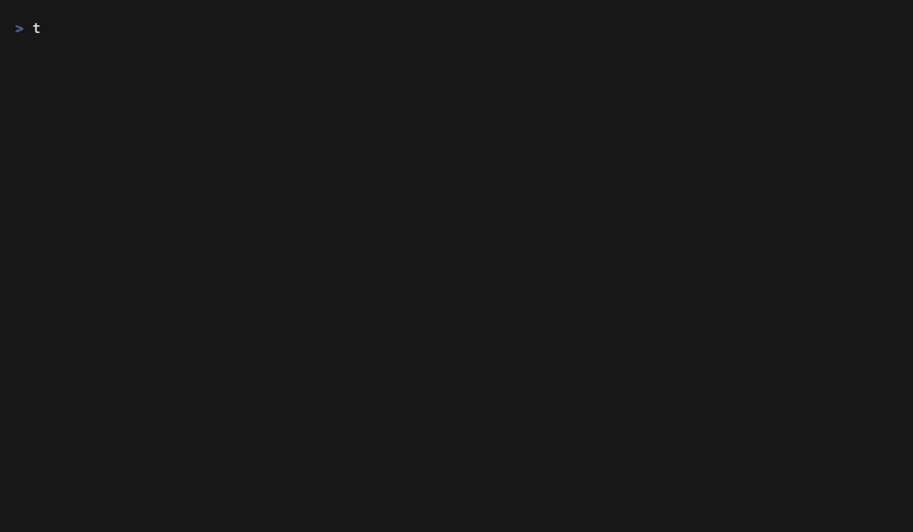

<p align="center">
  <h1 align="center">temper</h1>
  <p align="center">
    <strong>Never leave your terminal to find a domain.</strong>
  </p>
  <p align="center">
    Search domains, check availability, and open purchase pages — all from your terminal.<br>
    Works as a CLI, or as an MCP server so Claude and Cursor can search domains for you.
  </p>
  <p align="center">
    <a href="#install">Install</a> ·
    <a href="#usage">Usage</a> ·
    <a href="#mcp">MCP</a> ·
    <a href="#themes">Themes</a>
  </p>
</p>

<!-- TODO: demo GIF -->
<!-- <p align="center"></p> -->

---

## Why

AI coding tools can't check if a domain is available. Claude suggests a name, you open a browser, search manually, come back — the flow breaks every time.

**temper fixes this.** One command. 30 TLDs. Under 2 seconds.

```
$ temper search keycove

  ✓ Search complete 30/30 (1.7s)

  keycove.com     ✗ taken         491ms
  keycove.net     ✓ available     489ms
  keycove.dev     ✓ available     314ms
  keycove.io      ✓ available     359ms  (whois)
  keycove.app     ✓ available     241ms
  ...

  j/k move · enter buy · q quit
```

## Features

- **Private** — all queries run on your machine. No server, no logs, no tracking.
- **Fast** — 30 TLDs in under 2 seconds. 59 with `--extended`.
- **MCP native** — Claude Code, Claude Desktop, and Cursor can search domains directly.
- **Keyboard-first** — vim-style navigation, single-key registrar selection.
- **Themeable** — 5 built-in themes.
- **Open source** — MIT. Zero telemetry.

## Install

```bash
# Homebrew (macOS/Linux)
brew tap choi-jongjin/temper
brew install temper

# Or run with Bun
bun install && bun run src/index.ts search <name>
```

## Usage

### Search

```bash
temper search myproject                       # 30 TLDs
temper search myproject --extended            # 59 TLDs
temper search myproject --tlds=com,dev,io     # specific TLDs
```

Select a domain with `j`/`k`, press `Enter`, pick a registrar — the purchase page opens in your browser.

<!-- TODO: search screenshot -->

### Suggest

```bash
temper suggest keycove
```

15 name variations checked across `.com` `.dev` `.io` `.app` `.ai` in under 1 second.

```
  name                .com    .dev    .io     .app    .ai
  keycove             ✗       ✓       ✓       ✓       ✓
  getkeycove          ✗       ✓       ✓       ✓       ✓
  usekeycove          ✓       ✓       ✓       ✓       ✓
  trykeycove          ✓       ✓       ✓       ✓       ✓
  keycoveapp          ✓       ✓       ✓       ✓       ✓
  ...
```

<!-- TODO: suggest screenshot -->

### Watchlist & History

```bash
temper watch keycove.com      # track a taken domain
temper list                   # check current status
temper history                # view past searches
```

### Setup

```bash
temper init                           # first-time setup
temper config theme seoul-night       # change theme
```

<h2 id="mcp">MCP</h2>

temper runs as a local MCP server. Your AI assistant searches domains without you switching context.

```json
{
  "mcpServers": {
    "temper": {
      "command": "temper",
      "args": ["mcp"]
    }
  }
}
```

**Tools:** `search_domain` · `suggest_domain` · `check_domain_availability` · `open_registrar`

```
You:    "I'm building a habit tracker called streakly. Find me a domain."

Claude: [calls search_domain]
        streakly.com is taken, but these are available:
        - streakly.dev
        - streakly.app
        - streakly.io

You:    "Check getstreakly and trystreakly too"

Claude: [calls check_domain_availability]
        ✓ getstreakly.com — available
        ✓ trystreakly.com — available

You:    "Open Cloudflare for getstreakly.com"

Claude: [calls open_registrar]
        Done. Cloudflare opened in your browser.
```

All queries run locally. No data leaves your machine.

<h2 id="themes">Themes</h2>

<!-- TODO: theme screenshots -->
<!-- <p align="center"></p> -->

| Theme | |
|-------|---|
| **Temper Forge** | 🔥 Flame orange on dark steel |
| **Seoul Night** | 🌃 Neon pink, Han River blue |
| **Catppuccin Mocha** | 🎨 Soft pastels |
| **Dracula** | 🧛 High contrast |
| **Default** | ⚫ Terminal native |

## License

Apache 2.0 — see [LICENSE](./LICENSE)

---

<p align="center">
  <strong>temper</strong> — forged in the terminal. 🔥
</p>
